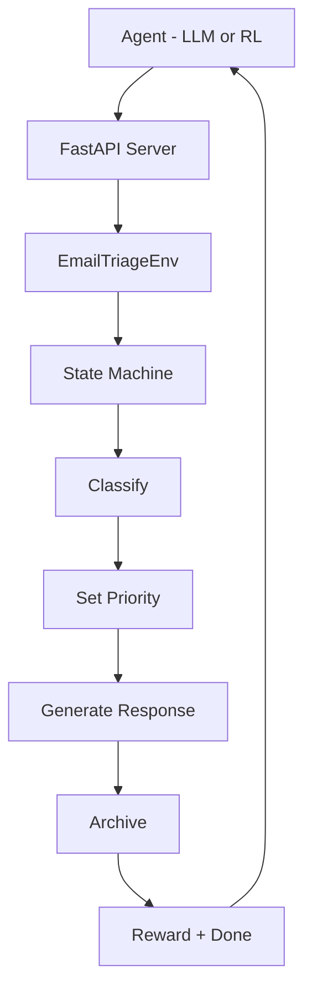
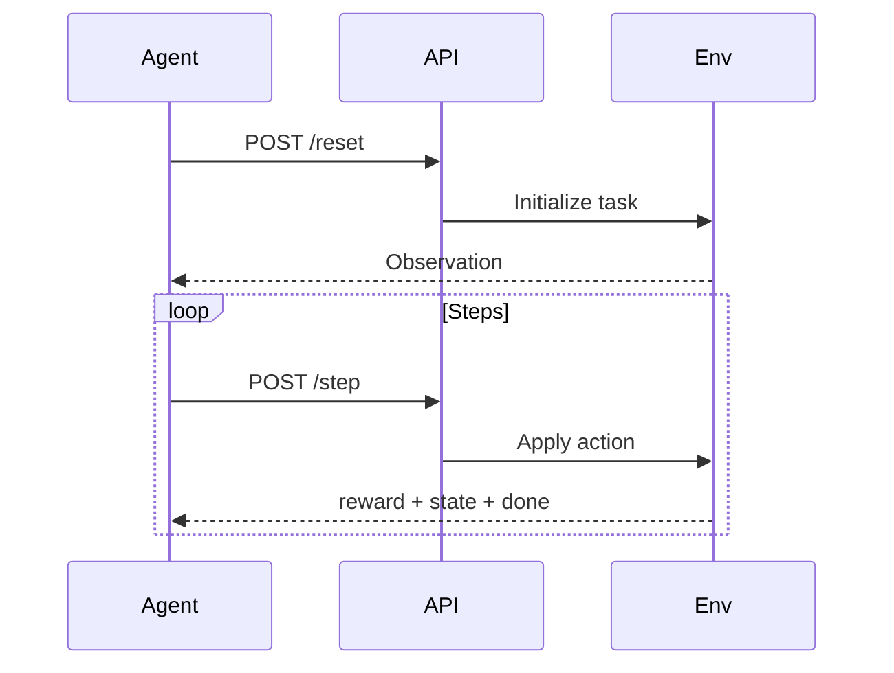
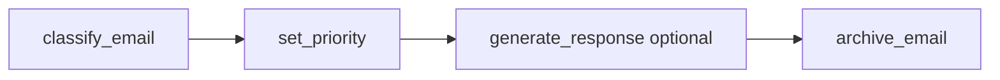
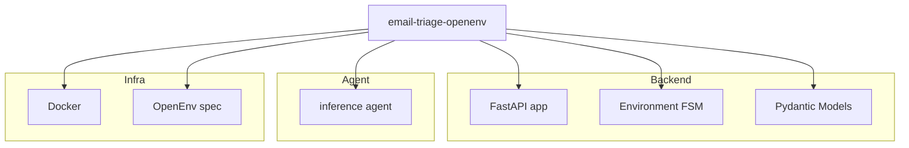

# Email Triage OpenEnv

An RL-style environment for intelligent email triage, designed to simulate real-world decision-making workflows using LLM agents and reward-based optimization.

Built for **OpenEnv Round 1**.
    
---

## Overview

Email overload is a major productivity bottleneck.   

This project models email triage as a **sequential decision-making problem**, where an agent must:

1. Classify the email  
2. Assign correct priority  
3. Generate response (if needed)  
4. Archive the email  

Each action is evaluated using a structured reward system, enabling reinforcement learning and LLM-based reasoning.

---

## Key Features

- RL-style environment with reward shaping  
- Finite State Machine (FSM)-based workflow  
- FastAPI-based interaction layer  
- LLM-compatible inference agent  
- Multi-task difficulty levels (easy → hard)  
- OpenEnv compliant architecture  
- Docker + HuggingFace deployment ready  

---

## System Architecture



---

## Environment Flow



---

## Action Pipeline



---

## Reward System

| Action | Condition | Reward |
|--------|----------|--------|
| classify_email | Correct | +0.30 |
| classify_email | Wrong | -0.15 |
| set_priority | Correct | +0.25 |
| set_priority | Wrong | -0.10 |
| generate_response | Appropriate | +0.20 |
| generate_response | Unnecessary | -0.10 |
| archive_email | Completion | +0.25 |
| Any | Wrong order | -0.05 |

**Max Score = 1.0**

---

## Observation Space

Each episode provides structured email input:

```json
{
  "subject": "Urgent: Q4 Budget Review",
  "sender": "manager@company.com",
  "body": "Meeting moved...",
  "metadata": {
    "is_internal": true,
    "spam_score": 0.1
  }
}
```

---

## Tasks

| Task | Difficulty | Description |
|------|----------|------------|
| easy_triage | Easy | Clear classification |
| medium_triage | Medium | Emotional + urgency |
| hard_triage | Hard | Phishing detection |

---

## Project Structure (Visual)



---

## API Endpoints

| Method | Endpoint | Description |
|--------|--------|------------|
| GET | / | Info |
| GET | /health | Health check |
| GET | /tasks | List tasks |
| POST | /reset | Start episode |
| POST | /step | Perform action |
| GET | /state | Current state |
| GET | /docs | Swagger UI |

---

## Setup & Run

### Local

```bash
pip install -r requirements.txt
uvicorn app.main:app --reload --port 8000
```

---

### Docker

```bash
docker build -t email-triage-openenv .
docker run -p 8000:8000 email-triage-openenv
```

---

### HuggingFace Spaces

- Use Docker SDK  
- Set port: 8000  
- Deploy directly  

---

## Running Agent

```bash
export API_BASE_URL="https://api-inference.huggingface.co/v1"
export MODEL_NAME="mistralai/Mistral-7B-Instruct-v0.3"
export HF_TOKEN="your_token"
export ENV_BASE_URL="http://localhost:8000"

python inference.py --all --verbose
```

---

## Key Highlights

- RL-compatible environment design  
- Sequential decision-making modeling  
- LLM + API integration  
- Production-ready backend  
- Evaluation-driven scoring system  

---

## Future Improvements

- Reinforcement Learning training loop  
- Multi-agent collaboration  
- Memory-based reasoning  
- Fine-tuned LLM policies  
- UI dashboard for visualization  

---

## License

MIT License

---

## Team

**Team Name:** Ace Programmers  

| Name | Role |
|------|-----|
| Rakesh Pedapudi | Team Lead · Backend · System Design |
| Bantu Nageswara Rao | Development |
| Akash Karthik Gummella | Development |

---

*Built for OpenEnv Hackathon 🏆*
